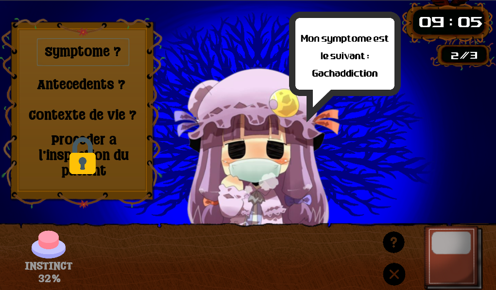
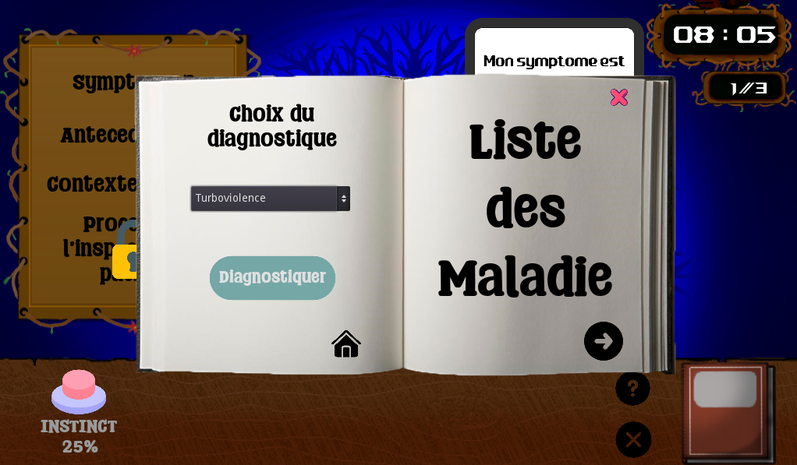
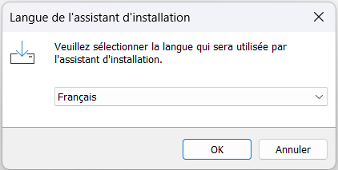
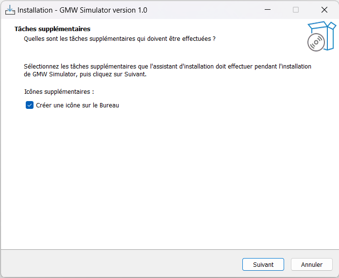
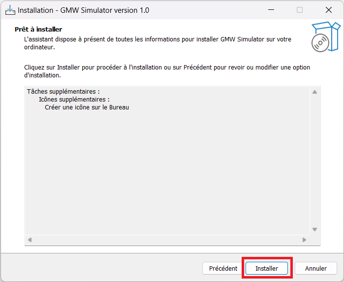
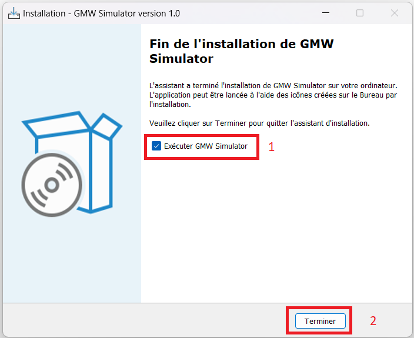

# T3

Nom du groupe : Great Wise Médecins

Code du groupe : JAL22-T3-C

Participants :

- Dorian JOLY
- Jeannot NAEGELY
- Arnaud NOEL
- Isaïe DEBEZE

## Méta-Todo

- [x] Mettre en place son GIT et préparer les milestones
- [x] Acquérir le sujet et définir un objectif pédagogique
- [x] Concevoir un poster qui décrit cet objectif pédagogique 
- [x] Définir le type de jeu et les mécanismes d'apprentissage (Septembre)
- [x] Définir la liste des principales fonctionnalités 
- [x] Développer ces fonctionnalités 
- [x] Evaluation à mi-parcours (Octobre)
- [x] Tester et équilibrer 
- [x] Choisir la Licence (Novembre)
- [x] Finaliser le git et produire la documentation
- [ ] Présenter son jeu et le faire évaluer (Décembre)

## Objectif pédagogique

Le joueur devra comprendre l'utilité d'un pré-diagnostic chez le médecin, pour identifier les maladies potentielles à partir des conditions de vie du patient (antécédent médicaux, mauvaises habitudes ou hygiène de vie). C'est cet important pré-diagnostic qui permet de gagner en précision lors du diagnostic final.

## Type de jeu et mécanismes d'apprentissage

Dans ce jeu, le joueur incarne un docteur qui va devoir réaliser le **diagnostic** de ses patients. Pour cela il disposera d'une **encyclopédie** des maladies contenant les **symptômes** et **antécédents** associés, et il pourra **questionner** le patient afin de produire un diagnostic correct. Un bouton d'**instinct** sera aussi disponible pour déclencher un diagnostic instantané avec un chance de réussite indiquée. Cette chance sera augmentée généralement après le traitement de plusieurs patients mais également par patient après avoir posé des questions.

Le jeu se déroulera sous formes de journées avec l'heure qui avancera à chaque action en jeu du joueur (lecture de l'encyclopédie, questionnement du patient, utilisation du bouton instinct,...).

Le joueur devra ainsi recevoir des patients durant plusieurs jours consécutifs à la fin desquels il saura combien de diagnostic réussis il a effectué. Le but est donc de faire comprendre au joueur que la répétition du questionnement lors du pré-diagnostic des patients est la clé qui permet d'améliorer l'instinct chez les médecins et que cet instinct est très important/utile pour gérer efficacement ses patients.

## Liste des principales fonctionnalités

- Plateforme de développement: **Godot**

Créer une issue par fonctionnalités.

- [x] Choix aléatoire des patients
- [x] Encyclopédie des maladies
- [x] Bouton d'instinct
- [x] Questionnement du patient
- [x] Rendu du diagnostic
- [x] Lancement d'une partie
- [x] Système de temps
- [x] Résumé des journées
- [x] Bouton tutoriel
- [x] Menu principal

## Justification du choix de la Licence

Nous avons choisi de poser une licence GNU GPL sur notre jeu car nous ne comptons pas le monétiser, et que nous n’avons aucune raison de refuser la modification ou la redistribution du code de celui-ci. Cependant nous voulons également que les potentielles modifications de notre jeu soient publiées sous la même licence car nous ne souhaitons pas que les versions modifiées soient monétisables.

## Lien de téléchargement

Pour ouvrir le projet, il est nécessaire de posséder le logiciel et moteur de jeu Godot Engine, disponible ici en téléchargement : **[Godot Engine](https://godotengine.org/download)** 

Vous pouvez cloner [le dépôt Git](https://git.unistra.fr/jal22-t3-c/jal-22-t-3-c) en entier ou si vous n'avez besoin que du projet Godot vous pouvez télécharger uniquement le dossier [GWM_Simulator](https://git.unistra.fr/jal22-t3-c/jal-22-t-3-c/-/tree/main/GWM_Simulator)

La documentation des scripts se trouve dans le dossier [Documentation](https://git.unistra.fr/jal22-t3-c/jal-22-t-3-c/-/tree/main/Documentation)

## Captures d'écran

### Capture d'écran d'une partie classique

### Capture d'écran du livre des maladie

## Procédures d'installation et d'exécution

**Le jeu ne fonctionne que sous Windows**

Pour télécharger notre jeu, il suffit de télécharger puis éxécuter l'installeur **GMW_Installeur.exe** se trouvant dans le dossier [Installeur](https://git.unistra.fr/jal22-t3-c/jal-22-t-3-c/-/tree/main/Installeur) du [dépôt Git](https://git.unistra.fr/jal22-t3-c/jal-22-t-3-c).

Vous pourrez ensuite suivre les étapes suivantes de l'installation :

1. Choisir la langue de l'installation, Français et Anglais disponibles

2. Vous pouvez choisir de créer un raccourci sur le bureau

3. Confirmez ensuite l'installation

4. Choississez si vous souhaiter lancer le jeu (1) puis fermer l'installeur (2)
